# RetailOps DevSecOps Labs 7.1–7.5 — 20 Mermaid Diagrams

**Application:** RetailOps Enterprise Order Management  
**Stack:** React, FastAPI, PostgreSQL, JWT, Docker, GitHub Actions, Checkov, Trivy, GHCR, Kubernetes, Argo CD.

These diagrams are teaching aids for the accompanying RetailOps project. The CI/CD diagrams reflect the supplied five-stage workflow design. Kubernetes and GitOps diagrams show the intended deployment architecture; environment-specific configuration (image SHA tags, secrets, registry access, ingress, and database connectivity) must be supplied before deployment.

## Diagram 01 — End-to-End RetailOps Architecture

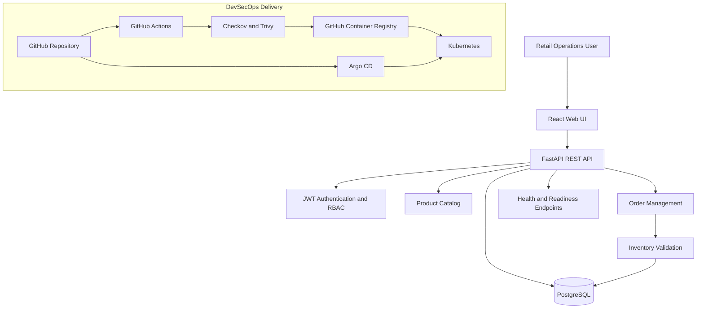
```mermaid
flowchart TD
    User[Retail Operations User] --> UI[React Web UI]
    UI --> API[FastAPI REST API]
    API --> Auth[JWT Authentication and RBAC]
    API --> DB[(PostgreSQL)]
    API --> Catalog[Product Catalog]
    API --> Orders[Order Management]
    Orders --> Inventory[Inventory Validation]
    Inventory --> DB
    API --> Health[Health and Readiness Endpoints]
    subgraph Delivery[DevSecOps Delivery]
      GH[GitHub Repository] --> Actions[GitHub Actions]
      Actions --> Scan[Checkov and Trivy]
      Scan --> GHCR[GitHub Container Registry]
      GHCR --> K8s[Kubernetes]
      GitOps[Argo CD] --> K8s
      GH --> GitOps
    end
```

## Diagram 02 — RetailOps Application Components

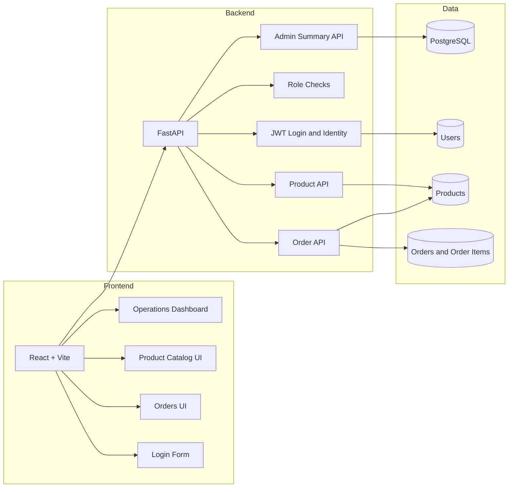
```mermaid
flowchart LR
    subgraph Frontend
      React[React + Vite]
      Dashboard[Operations Dashboard]
      CatalogUI[Product Catalog UI]
      OrdersUI[Orders UI]
      Login[Login Form]
    end
    subgraph Backend
      FastAPI[FastAPI]
      Auth[JWT Login and Identity]
      RBAC[Role Checks]
      ProductAPI[Product API]
      OrderAPI[Order API]
      AdminAPI[Admin Summary API]
    end
    subgraph Data
      PostgreSQL[(PostgreSQL)]
      Users[(Users)]
      Products[(Products)]
      OrderRows[(Orders and Order Items)]
    end
    React --> Dashboard
    React --> CatalogUI
    React --> OrdersUI
    React --> Login
    React --> FastAPI
    FastAPI --> Auth
    FastAPI --> RBAC
    FastAPI --> ProductAPI
    FastAPI --> OrderAPI
    FastAPI --> AdminAPI
    Auth --> Users
    ProductAPI --> Products
    OrderAPI --> Products
    OrderAPI --> OrderRows
    AdminAPI --> PostgreSQL
```

## Diagram 03 — Five-Stage Lab Roadmap

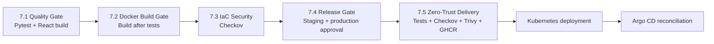
```mermaid
flowchart LR
    S71["7.1 Quality Gate<br/>Pytest + React build"] --> S72["7.2 Docker Build Gate<br/>Build after tests"]
    S72 --> S73["7.3 IaC Security<br/>Checkov"]
    S73 --> S74["7.4 Release Gate<br/>Staging + production approval"]
    S74 --> S75["7.5 Zero-Trust Delivery<br/>Tests + Checkov + Trivy + GHCR"]
    S75 --> Deploy["Kubernetes deployment"]
    Deploy --> GitOps["Argo CD reconciliation"]
```

## Diagram 04 — Developer-to-Production Flow

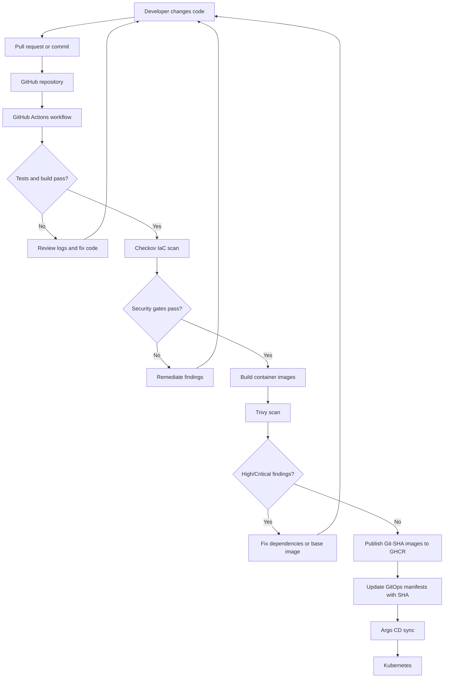
```mermaid
flowchart TD
    Dev[Developer changes code] --> PR[Pull request or commit]
    PR --> Repo[GitHub repository]
    Repo --> CI[GitHub Actions workflow]
    CI --> Quality{Tests and build pass?}
    Quality -- No --> Fix[Review logs and fix code]
    Fix --> Dev
    Quality -- Yes --> IaC[Checkov IaC scan]
    IaC --> Sec{Security gates pass?}
    Sec -- No --> Remediate[Remediate findings]
    Remediate --> Dev
    Sec -- Yes --> Build[Build container images]
    Build --> Trivy[Trivy scan]
    Trivy --> Vuln{High/Critical findings?}
    Vuln -- Yes --> RemediateImage[Fix dependencies or base image]
    RemediateImage --> Dev
    Vuln -- No --> Publish[Publish Git-SHA images to GHCR]
    Publish --> GitOps[Update GitOps manifests with SHA]
    GitOps --> Argo[Argo CD sync]
    Argo --> K8s[Kubernetes]
```

## Diagram 05 — Lab 7.1 Quality Gate

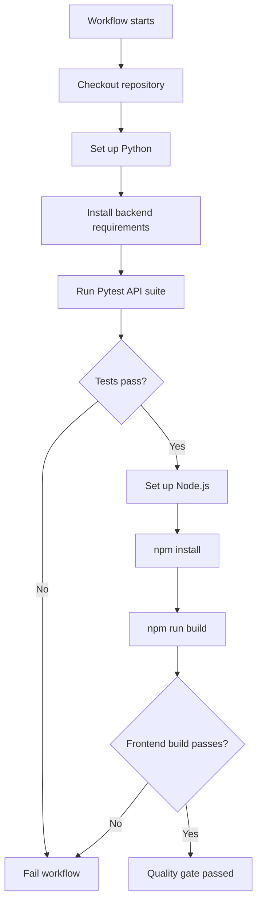
```mermaid
flowchart TD
    Start[Workflow starts] --> Checkout[Checkout repository]
    Checkout --> PySetup[Set up Python]
    PySetup --> InstallPy[Install backend requirements]
    InstallPy --> Pytest[Run Pytest API suite]
    Pytest --> PyPass{Tests pass?}
    PyPass -- No --> Fail[Fail workflow]
    PyPass -- Yes --> Node[Set up Node.js]
    Node --> Npm[npm install]
    Npm --> Build[npm run build]
    Build --> BuildPass{Frontend build passes?}
    BuildPass -- No --> Fail
    BuildPass -- Yes --> Green[Quality gate passed]
```

## Diagram 06 — Lab 7.2 Docker Build Gate

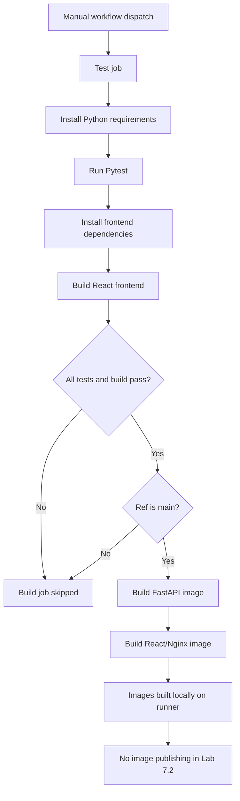
```mermaid
flowchart TD
    Trigger[Manual workflow dispatch] --> TestJob[Test job]
    TestJob --> API[Install Python requirements]
    API --> Pytest[Run Pytest]
    Pytest --> Frontend[Install frontend dependencies]
    Frontend --> NpmBuild[Build React frontend]
    NpmBuild --> TestsOK{All tests and build pass?}
    TestsOK -- No --> Skip[Build job skipped]
    TestsOK -- Yes --> Main{Ref is main?}
    Main -- No --> Skip
    Main -- Yes --> APIImage[Build FastAPI image]
    APIImage --> WebImage[Build React/Nginx image]
    WebImage --> Done[Images built locally on runner]
    Done --> Note[No image publishing in Lab 7.2]
```

## Diagram 07 — Lab 7.3 Infrastructure-as-Code Scan

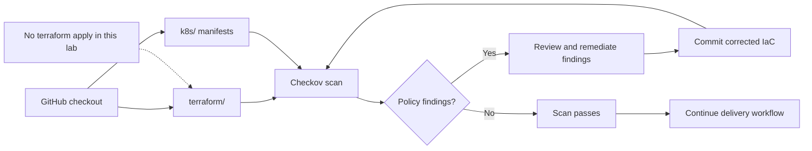
```mermaid
flowchart LR
    Repo[GitHub checkout] --> TF[terraform/]
    Repo --> K8S[k8s/ manifests]
    TF --> Checkov[Checkov scan]
    K8S --> Checkov
    Checkov --> Findings{Policy findings?}
    Findings -- Yes --> Review[Review and remediate findings]
    Findings -- No --> Pass[Scan passes]
    Review --> Commit[Commit corrected IaC]
    Commit --> Checkov
    Pass --> Next[Continue delivery workflow]
    Note[No terraform apply in this lab] -.-> TF
```

## Diagram 08 — Lab 7.4 Environment-Based Release Gate

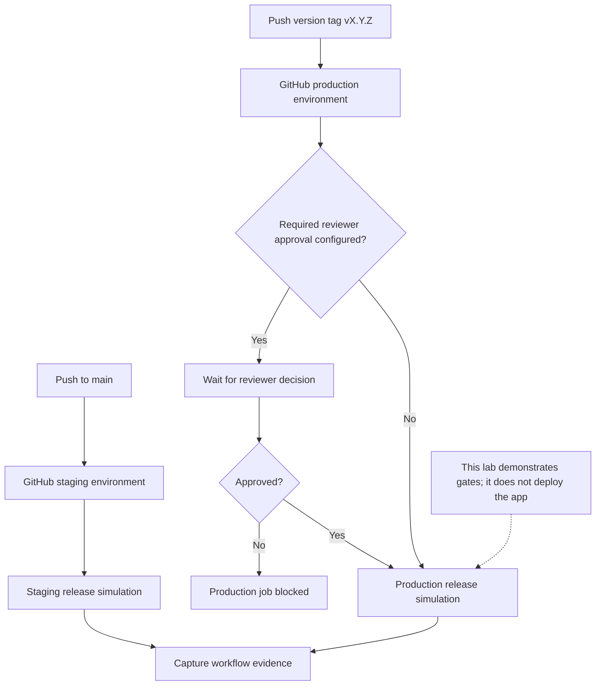
```mermaid
flowchart TD
    Push[Push to main] --> Staging[GitHub staging environment]
    Staging --> StageSim[Staging release simulation]
    Tag[Push version tag vX.Y.Z] --> Production[GitHub production environment]
    Production --> Approval{Required reviewer approval configured?}
    Approval -- Yes --> Wait[Wait for reviewer decision]
    Wait --> Decision{Approved?}
    Decision -- No --> Block[Production job blocked]
    Decision -- Yes --> ProdSim[Production release simulation]
    Approval -- No --> ProdSim
    StageSim --> Evidence[Capture workflow evidence]
    ProdSim --> Evidence
    Reminder[This lab demonstrates gates; it does not deploy the app] -.-> ProdSim
```

## Diagram 09 — Lab 7.5 Zero-Trust Delivery Pipeline

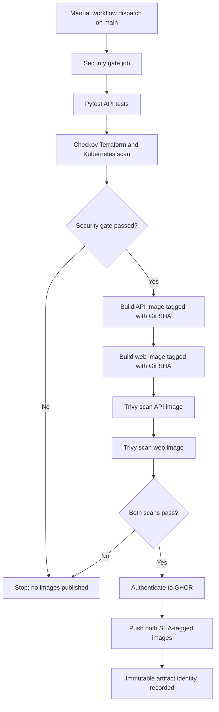
```mermaid
flowchart TD
    Dispatch[Manual workflow dispatch on main] --> Gate[Security gate job]
    Gate --> Tests[Pytest API tests]
    Tests --> Checkov[Checkov Terraform and Kubernetes scan]
    Checkov --> GatePass{Security gate passed?}
    GatePass -- No --> Stop[Stop; no images published]
    GatePass -- Yes --> APIBuild[Build API image tagged with Git SHA]
    APIBuild --> WebBuild[Build web image tagged with Git SHA]
    WebBuild --> ScanAPI[Trivy scan API image]
    ScanAPI --> ScanWeb[Trivy scan web image]
    ScanWeb --> Clean{Both scans pass?}
    Clean -- No --> Stop
    Clean -- Yes --> Login[Authenticate to GHCR]
    Login --> Push[Push both SHA-tagged images]
    Push --> Complete[Immutable artifact identity recorded]
```

## Diagram 10 — JWT Authentication Sequence

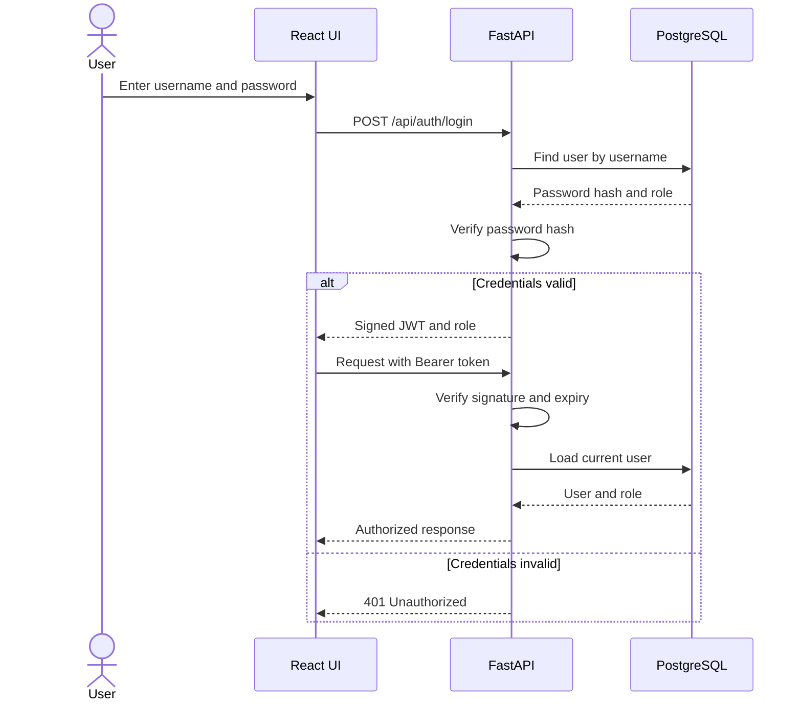
```mermaid
sequenceDiagram
    actor User
    participant UI as React UI
    participant API as FastAPI
    participant DB as PostgreSQL
    User->>UI: Enter username and password
    UI->>API: POST /api/auth/login
    API->>DB: Find user by username
    DB-->>API: Password hash and role
    API->>API: Verify password hash
    alt Credentials valid
      API-->>UI: Signed JWT and role
      UI->>API: Request with Bearer token
      API->>API: Verify signature and expiry
      API->>DB: Load current user
      DB-->>API: User and role
      API-->>UI: Authorized response
    else Credentials invalid
      API-->>UI: 401 Unauthorized
    end
```

## Diagram 11 — Role-Based Access Control

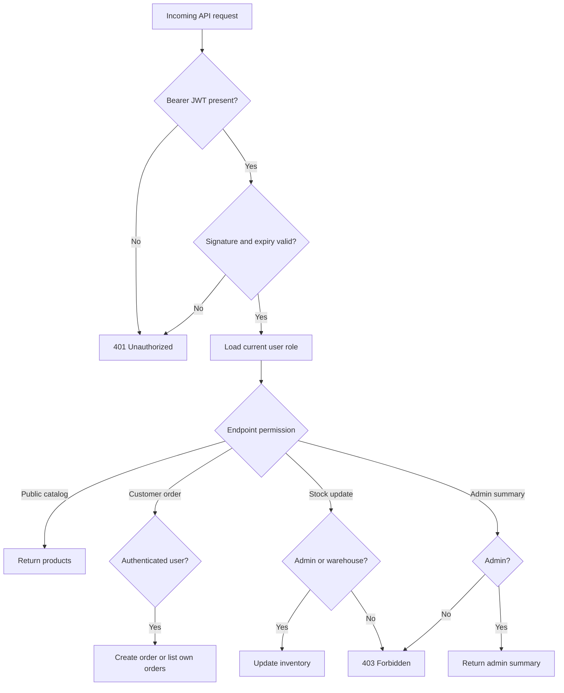
```mermaid
flowchart TD
    Request[Incoming API request] --> Token{Bearer JWT present?}
    Token -- No --> U401[401 Unauthorized]
    Token -- Yes --> Verify{Signature and expiry valid?}
    Verify -- No --> U401
    Verify -- Yes --> Role[Load current user role]
    Role --> Endpoint{Endpoint permission}
    Endpoint -- Public catalog --> Catalog[Return products]
    Endpoint -- Customer order --> Customer{Authenticated user?}
    Customer -- Yes --> OwnOrder[Create order or list own orders]
    Endpoint -- Stock update --> Staff{Admin or warehouse?}
    Staff -- Yes --> Stock[Update inventory]
    Staff -- No --> F403[403 Forbidden]
    Endpoint -- Admin summary --> Admin{Admin?}
    Admin -- Yes --> Summary[Return admin summary]
    Admin -- No --> F403
```

## Diagram 12 — Order Placement and Inventory Update

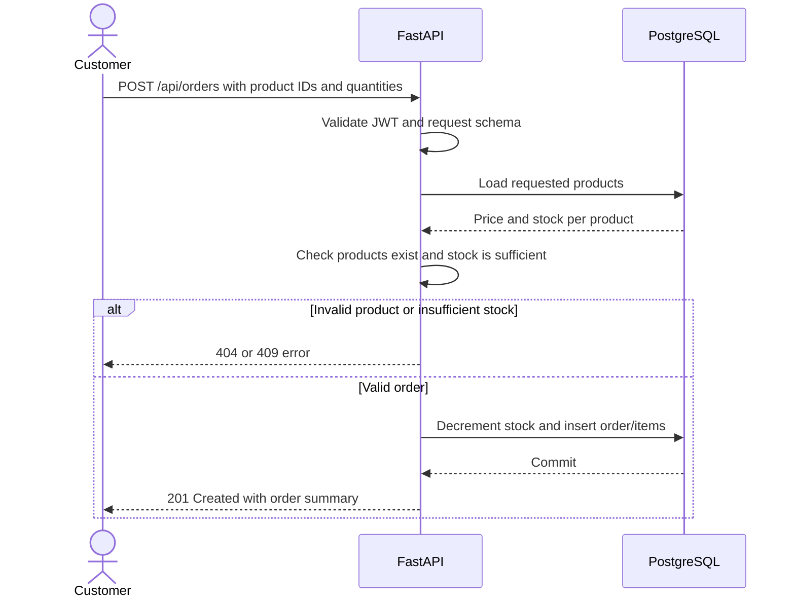
```mermaid
sequenceDiagram
    actor Customer
    participant API as FastAPI
    participant DB as PostgreSQL
    Customer->>API: POST /api/orders with product IDs and quantities
    API->>API: Validate JWT and request schema
    API->>DB: Load requested products
    DB-->>API: Price and stock per product
    API->>API: Check products exist and stock is sufficient
    alt Invalid product or insufficient stock
      API-->>Customer: 404 or 409 error
    else Valid order
      API->>DB: Decrement stock and insert order/items
      DB-->>API: Commit
      API-->>Customer: 201 Created with order summary
    end
```

## Diagram 13 — Order Status Lifecycle

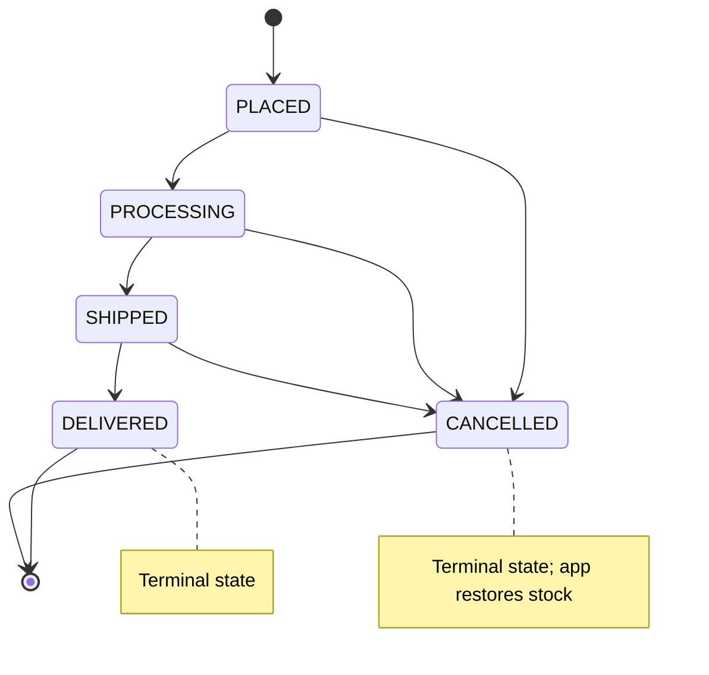
```mermaid
stateDiagram-v2
    [*] --> PLACED
    PLACED --> PROCESSING
    PLACED --> CANCELLED
    PROCESSING --> SHIPPED
    PROCESSING --> CANCELLED
    SHIPPED --> DELIVERED
    SHIPPED --> CANCELLED
    DELIVERED --> [*]
    CANCELLED --> [*]
    note right of DELIVERED
      Terminal state
    end note
    note right of CANCELLED
      Terminal state; app restores stock
    end note
```

## Diagram 14 — Database Entity Relationship

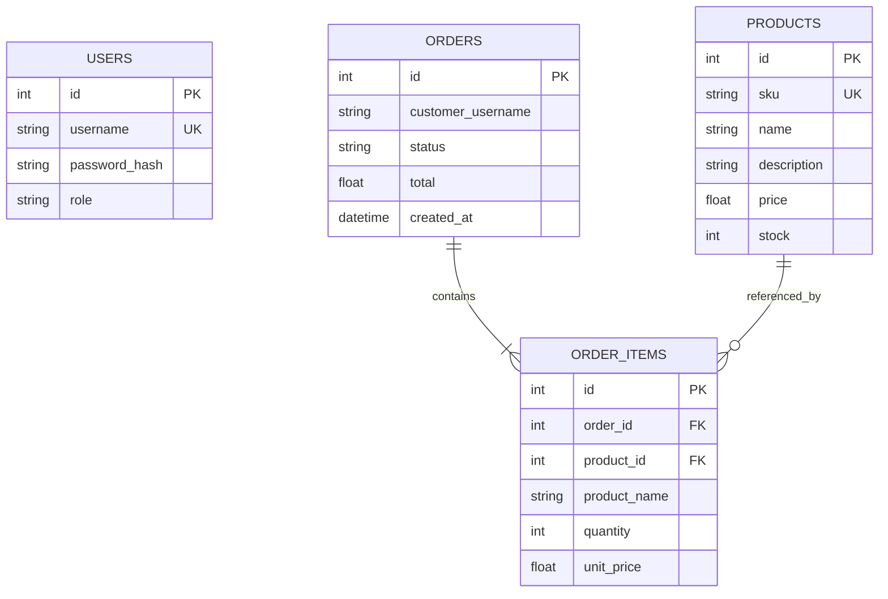
```mermaid
erDiagram
    USERS {
      int id PK
      string username UK
      string password_hash
      string role
    }
    PRODUCTS {
      int id PK
      string sku UK
      string name
      string description
      float price
      int stock
    }
    ORDERS {
      int id PK
      string customer_username
      string status
      float total
      datetime created_at
    }
    ORDER_ITEMS {
      int id PK
      int order_id FK
      int product_id FK
      string product_name
      int quantity
      float unit_price
    }
    ORDERS ||--|{ ORDER_ITEMS : contains
    PRODUCTS ||--o{ ORDER_ITEMS : referenced_by
```

## Diagram 15 — Docker Compose Local Runtime

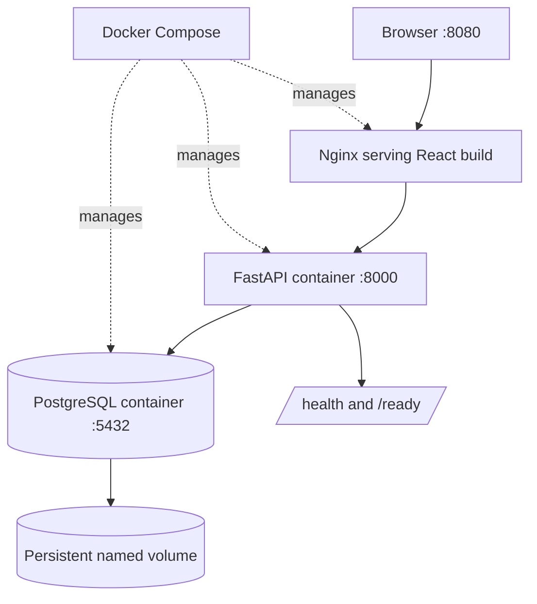
```mermaid
flowchart TD
    Browser[Browser :8080] --> Web[Nginx serving React build]
    Web --> API[FastAPI container :8000]
    API --> DB[(PostgreSQL container :5432)]
    Compose[Docker Compose] -. manages .-> Web
    Compose -. manages .-> API
    Compose -. manages .-> DB
    DB --> Volume[(Persistent named volume)]
    API --> Health[/health and /ready/]
```

## Diagram 16 — Container Image Supply Chain

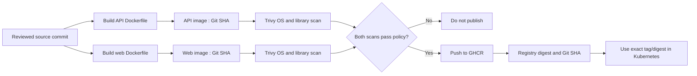
```mermaid
flowchart LR
    Source[Reviewed source commit] --> DockerAPI[Build API Dockerfile]
    Source --> DockerWeb[Build web Dockerfile]
    DockerAPI --> APIImage[API image : Git SHA]
    DockerWeb --> WebImage[Web image : Git SHA]
    APIImage --> TrivyAPI[Trivy OS and library scan]
    WebImage --> TrivyWeb[Trivy OS and library scan]
    TrivyAPI --> Policy{Both scans pass policy?}
    TrivyWeb --> Policy
    Policy -- No --> Reject[Do not publish]
    Policy -- Yes --> GHCR[Push to GHCR]
    GHCR --> Digest[Registry digest and Git SHA]
    Digest --> Deploy[Use exact tag/digest in Kubernetes]
```

## Diagram 17 — Kubernetes Runtime Architecture

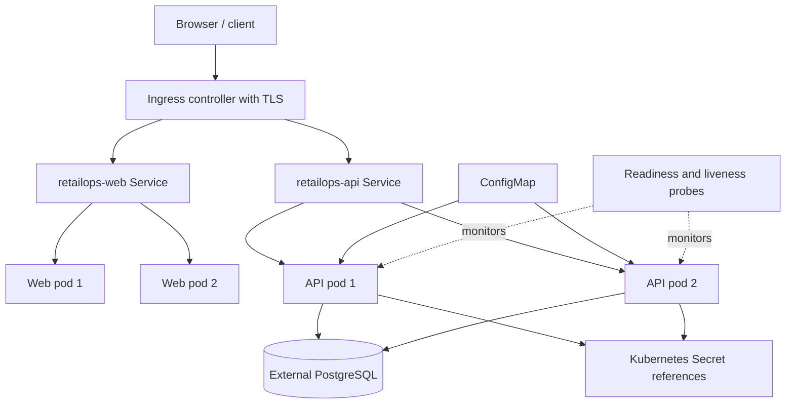
```mermaid
flowchart TD
    Client[Browser / client] --> Ingress[Ingress controller with TLS]
    Ingress --> WebSvc[retailops-web Service]
    Ingress --> APISvc[retailops-api Service]
    WebSvc --> Web1[Web pod 1]
    WebSvc --> Web2[Web pod 2]
    APISvc --> API1[API pod 1]
    APISvc --> API2[API pod 2]
    API1 --> PG[(External PostgreSQL)]
    API2 --> PG
    API1 --> Secret[Kubernetes Secret references]
    API2 --> Secret
    Config[ConfigMap] --> API1
    Config --> API2
    Probe[Readiness and liveness probes] -. monitors .-> API1
    Probe -. monitors .-> API2
```

## Diagram 18 — Argo CD GitOps Reconciliation

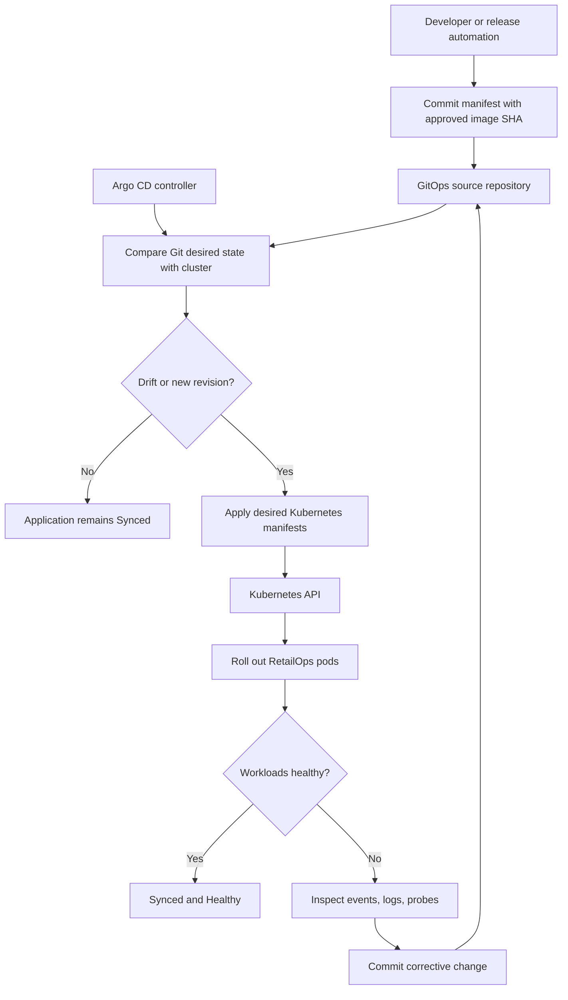
```mermaid
flowchart TD
    Dev[Developer or release automation] --> Change[Commit manifest with approved image SHA]
    Change --> Git[GitOps source repository]
    Argo[Argo CD controller] --> Compare[Compare Git desired state with cluster]
    Git --> Compare
    Compare --> Drift{Drift or new revision?}
    Drift -- No --> Healthy[Application remains Synced]
    Drift -- Yes --> Sync[Apply desired Kubernetes manifests]
    Sync --> K8s[Kubernetes API]
    K8s --> Pods[Roll out RetailOps pods]
    Pods --> Health{Workloads healthy?}
    Health -- Yes --> Synced[Synced and Healthy]
    Health -- No --> Diagnose[Inspect events, logs, probes]
    Diagnose --> Fix[Commit corrective change]
    Fix --> Git
```

## Diagram 19 — Observability and Troubleshooting Path

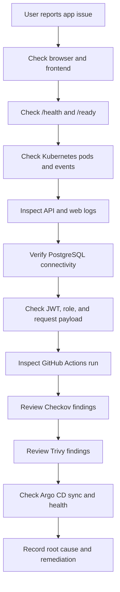
```mermaid
flowchart TD
    Symptom[User reports app issue] --> UI[Check browser and frontend]
    UI --> APIHealth[Check /health and /ready]
    APIHealth --> Pods[Check Kubernetes pods and events]
    Pods --> Logs[Inspect API and web logs]
    Logs --> DB[Verify PostgreSQL connectivity]
    DB --> Auth[Check JWT, role, and request payload]
    Auth --> Pipeline[Inspect GitHub Actions run]
    Pipeline --> Checkov[Review Checkov findings]
    Checkov --> Trivy[Review Trivy findings]
    Trivy --> GitOps[Check Argo CD sync and health]
    GitOps --> RootCause[Record root cause and remediation]
```

## Diagram 20 — End-to-End Student Validation Checklist

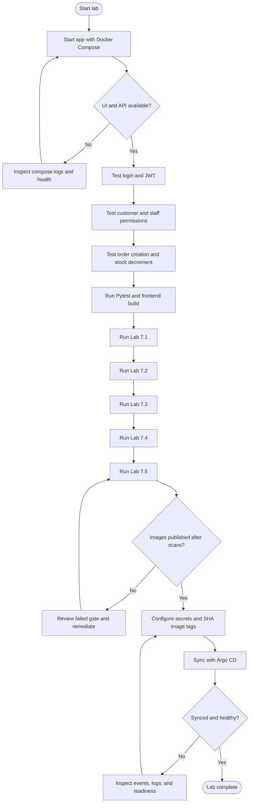
```mermaid
flowchart TD
    Start([Start lab]) --> Local[Start app with Docker Compose]
    Local --> UI{UI and API available?}
    UI -- No --> FixLocal[Inspect compose logs and health]
    FixLocal --> Local
    UI -- Yes --> Auth[Test login and JWT]
    Auth --> RBAC[Test customer and staff permissions]
    RBAC --> Orders[Test order creation and stock decrement]
    Orders --> Tests[Run Pytest and frontend build]
    Tests --> S71[Run Lab 7.1]
    S71 --> S72[Run Lab 7.2]
    S72 --> S73[Run Lab 7.3]
    S73 --> S74[Run Lab 7.4]
    S74 --> S75[Run Lab 7.5]
    S75 --> Publish{Images published after scans?}
    Publish -- No --> Diagnose[Review failed gate and remediate]
    Diagnose --> S75
    Publish -- Yes --> K8s[Configure secrets and SHA image tags]
    K8s --> Argo[Sync with Argo CD]
    Argo --> Healthy{Synced and healthy?}
    Healthy -- No --> Debug[Inspect events, logs, and readiness]
    Debug --> K8s
    Healthy -- Yes --> Done([Lab complete])
```

---

## Teaching notes

- **Labs 7.1–7.5** are separate workflow entry points in one repository; the application and local setup are shared.
- **Lab 7.4** is an environment/approval demonstration, not an actual Kubernetes deployment workflow.
- **Lab 7.5** publishes images only after its test, Checkov, and Trivy gates pass on `main`.
- Before deploying, update Kubernetes manifests to the exact image SHA, configure secret values, provide PostgreSQL connectivity, and set up ingress/TLS if external access is required.
- Checkov findings may change as policies and tool versions evolve; review the findings rather than assuming every scan result is identical across versions.
